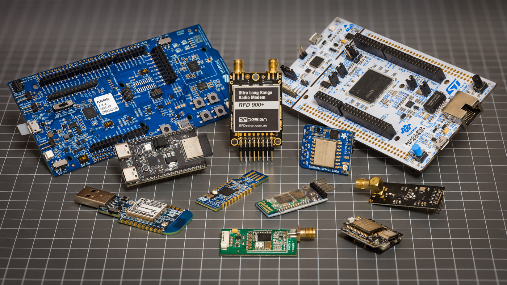
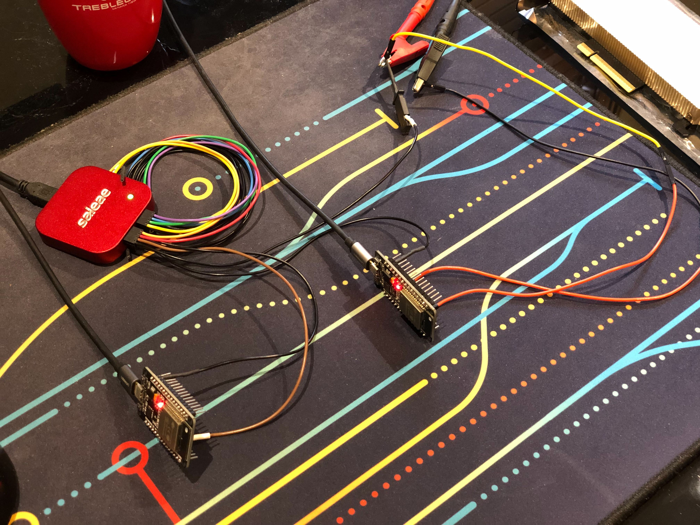
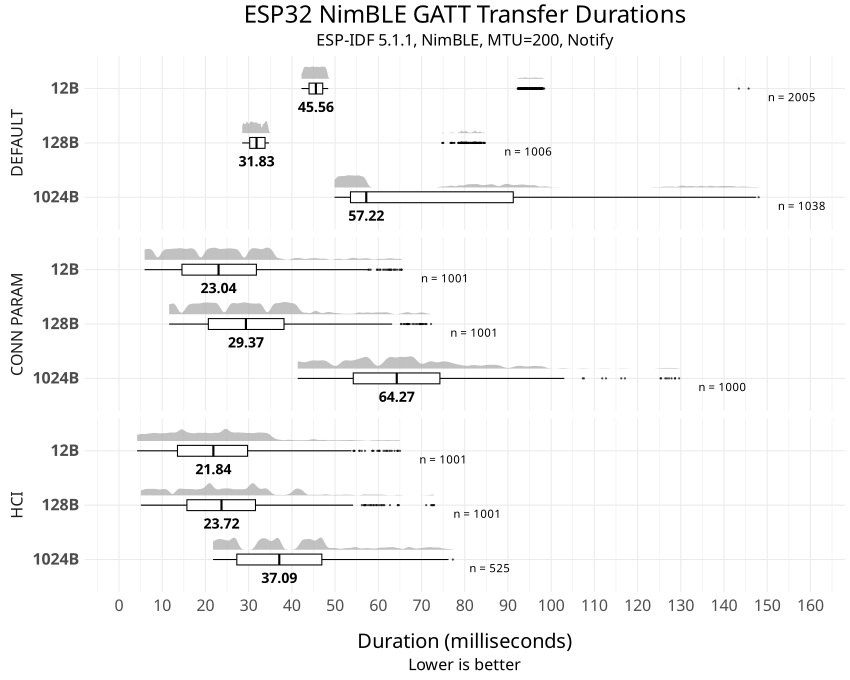

# Microbenchmarking Wireless Modules for Embedded Projects

This repo contains the test firmware, raw logs and post-processing scripts for my ["Comparing latencies of common wireless links for microcontrollers" blog post](https://electricui.com/blog/latency-comparison).

If you have any suggestions or feedback for the completed or any future tests, [make an issue](https://github.com/Scottapotamas/embedded-wireless-latency-eval/issues/new) or email me.

At some point I might also compare power consumption and range behaviour.

## Test Firmware

`/firmware` contains sub-folders with project setups for the test variations. Each project has it's own README with minimal description and instructions.

In general:

- Ensure firmware is built with release optimisations for performance i.e. `-o2`.
- Disable any debug logging or console echo as these impact test results.
- For most build-chains I used environment variables to control which test packet size is sent/expected. 

The raw logic-analyser captures have been left in these folders because I'm too lazy to re-organise the tree...

## Experiment Setup

Test setups normally looked like a variation of this:

**Equipment:**

- Rigol DG1000 series signal generator to produce stimulus test pulses.
- Saleae Logic 8 for test timing capture.
- RSA3000 series real-time spectrum analyser.
- Oscilloscope & [Minicircuits ZX47-60-S+](https://www.minicircuits.com/WebStore/dashboard.html?model=ZX47-60-S%2B) RF power meter.
- My treasured assortment of RF adapters, antennas, test cables, etc.

**Process:**

- Use spectrum analyser to check the spectral region of interest isn't occupied. 
  - Disable other hardware, add shielding and generally reduce noise floor where possible.
- Flash two identical devkits and/or breakout boards with relevant benchmark firmware, 
  - Typically positioned on table 1 m apart (closer for the photo).
  - Connected to host PC for power and programming.
- Signal generator provides a 3.3 VDC, 50 μs wide square pulse at configurable interval as stimulus signal. 
  - The interval was typically set manually to ensure the test was completed in half the trigger interval.
  - Some exceptions were made (i.e. LoRA), but I always test for any impact of trigger interval on the link behaviour prior to recording data.
- When the trigger signal is flagged in firmware, the relevant test payload is sent.
- When the payload is recieved by the other board, it checks length and CRC.
- If valid, the micro drives an IO line high to indicate a valid transmission.
- The logic analyser captures both the trigger and complete signals at 100 MS/s (10 ns resolution).
  - I typically captured for 1000x the trigger interval, i.e. 200 seconds for a 200 ms trigger interval.

## Data Processing

Some R scripts help reshape the data from the Saleae Logic edge-timing export to pretty looking comparison charts like these:

- `saleae-latency-log-cleanup.R` will create a column per valid `.csv` file in the working directory  with rows per identified stimulus/result edge timing in milliseconds.
  - For most hardware benchmark tests, I've left the post-processed files in the analysis folder.
- `ridgeline.R` was used for simpler plots - typically comparing the test packet sizes for a given setup. 
  - The filename for a converted `.csv` from the prior step needs to be set in the script, along with relevant title changes and manually configured x-axis bounds.
  - It generates a .svg file. These aren't kept in this repo, but can be seen in the blog post.
- Other ridgeline variation scripts handle more complex comparisons with chart facets. These typically have extra logic hacked on to improve specific comparisons.

> I should point out that I don't really know or use R - it was just what I decided to try for this project, so sorry in advance if you actually read the R scripts...